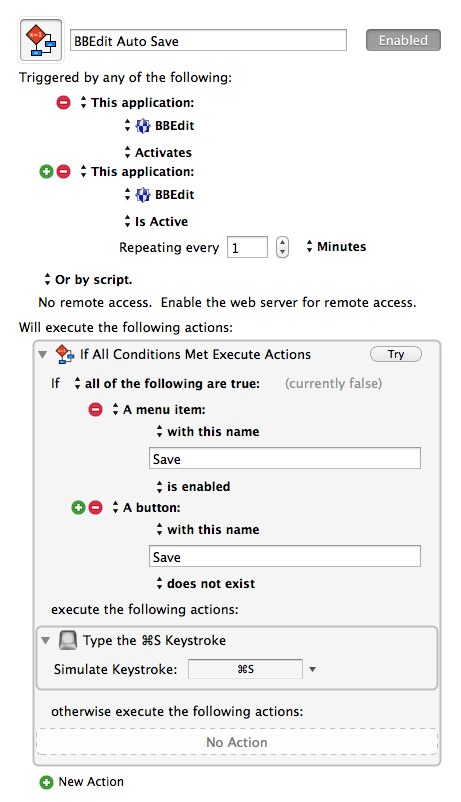
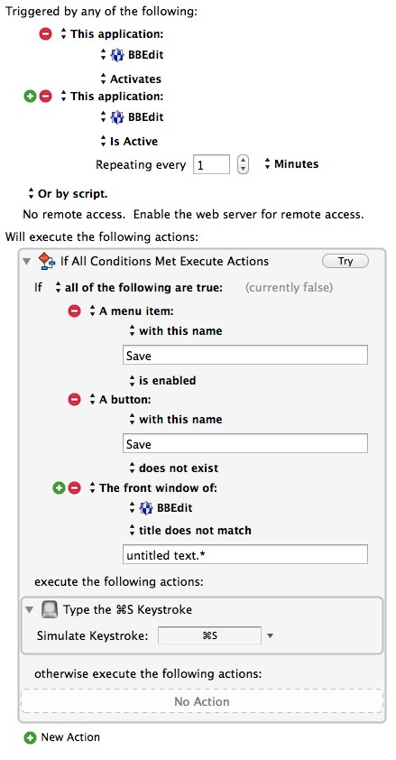

km-bbedit-autosave
==================

BBEdit includes an “auto-save” function, but it is intended primarily as “crash recovery” rather than the equivalent of pressing <kbd>⌘</kbd>  + <kbd>S</kbd> every *X* minutes.[^citation]

In order to avoid any risk of lost data, I use a [Keyboard Maestro] macro with BBEdit, which I will first show, and then explain:

The top part in white shows the conditions under which the macro will launch:

1.	Any time BBEdit “activates” (i.e. when switching to BBEdit from another app)
2.	When BBEdit is the “active” (front-most) application for at least 60 seconds, consecutively.

The bottom part checks for additional conditions:

1.	The _Menu_ item “Save” is enabled
2.	There is no _Button_ with the name “Save”

The first should seem obvious, but the second might not: the Save _button_ only appears when the “Save As” dialog box is open, usually when a file has not been named. If you save when that dialog box is open, you will get a saved file with a name like “Untitled.txt” which I find far too annoying to allow.

If both of those conditions are met, then the keyboard command <kbd>⌘</kbd>  + <kbd>S</kbd> is given which will cause the document to be saved.

*	You could also tell Keyboard Maestro to select the menu item File » Save but I prefer the keyboard shortcut.
*	If the file has not already been named, this will bring up the “Save As” dialog box. This might cause an interruption when you are creating a new file, which might be annoying, but less so than losing unsaved data. However, if you prefer *not* to be interrupted and to only have files auto-saved *after* you have named them, you can simply add another condition to Keyboard Maestro, telling it not to save if the *title* of the front window starts with the words “untitled text” as shown here:

Note that the actual condition for the front window title is actually written as `untitled text.*` which will match `untitled text`  as well as `untitled text 2` and so forth, which is how BBEdit names unsaved files.

I refer to this as the “polite” version of the macro since it refuses to interrupt you, even for your own good.

## Download and Installation

To use one of the macros, select which one you want from these two options:

*	[BBEdit-Auto-Save.kmmacros](BBEdit-Auto-Save.kmmacros)
*	[BBEdit-Auto-Save-polite.kmmacros](BBEdit-Auto-Save-polite.kmmacros)

Download the file (control-click the link) and make sure that the filename ends with `.kmmacros`.

You can import it into Keyboard Maestro either by double-clicking on the file (it may not work if Keyboard Maestro Editor is not already running), or by using the **File » Import Macros…** menu inside the Keyboard Maestro app.

## Other Applications ##

This technique can easily be replicated in other applications. In fact, I used a variation of this macro when working on my thesis. I have also used it when beta  testing other applications which might not recover from crashes as gracefully as BBEdit does.

Before you think that apps which support “Versions” and the “auto-save” feature found in Lion and later versions of OS X do not need this, let me assure you that I *have* lost unsaved data in apps which support those features. **The only way to be sure that your document is saved is to save it.** This is especially useful when combined with [Dropbox’s versioning feature][2].

[^citation]:  See <https://groups.google.com/d/msg/bbedit/nYO0NxuVt0o/9CM7ROiEHYAJ>.

[Keyboard Maestro]: http://www.keyboardmaestro.com/main/

[2]: http://www.tuaw.com/2013/03/14/a-quick-guide-to-dropbox-versioning/
